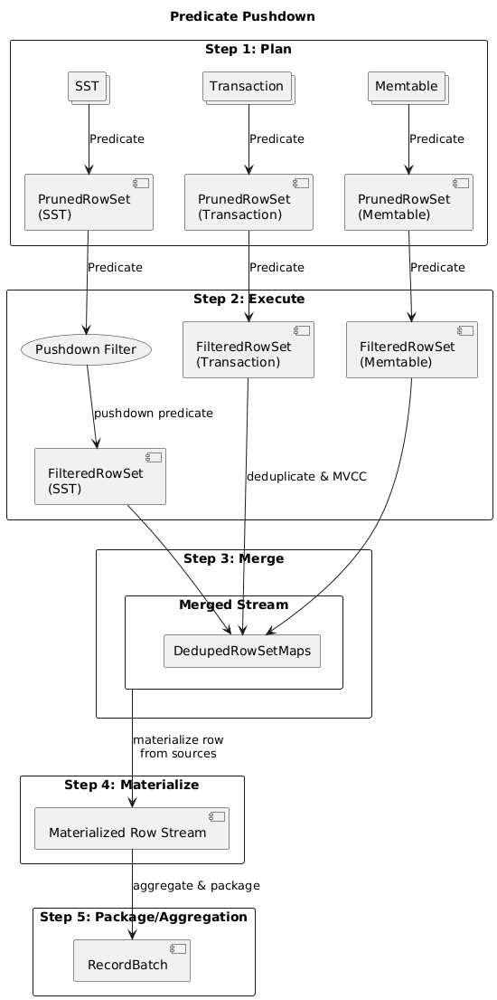
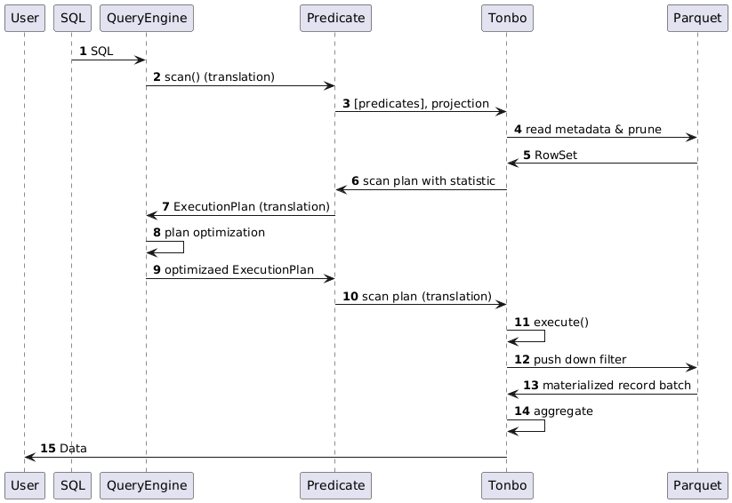

# RFC 0010: Two-Phase Read

- Status: Draft
- Authors: Tonbo storage team
- Created: 2025-11-04
- Area: Read path, MVCC, Manifest, Sst, Transaction

## Summary

Tonbo’s architecture calls for a manifest-driven, two-phase read pipeline that first plans and prunes rows, then uses streaming to build record batches. There is no detailed design describing how two-phase reads should work or how they fit into the Parquet/Arrow ecosystem and the query engine layer. This RFC fills that gap with an MVP design.

## Goals

1. Provide a unified `Predicate` surface that upper query layers can translate to and from with minimal glue.
2. Establish a planning stage that pushes predicates as far as possible and prunes Parquet pages using available statistics.
3. Deliver an execution stage that is MVCC-aware and streams Arrow batches without redundant copying.

## Non-goals

- Full end-to-end integration work in external query engines (e.g., query rewrites inside DataFusion or Postgres FDWs).
- Transactional wiring is temporarily out of scope; this RFC focuses on the read path itself.

## Background

Tonbo’s current read path exposes ad-hoc helpers such as `scan_mutable_rows` that walk memtables and SSTs directly for every request. Predicate pushdown is best-effort, per-source, and tightly coupled to each iterator. There is no shared `Predicate` representation, no reusable `RowSet` that callers can intersect or union, and no API for planning once then reusing the same row ids for different projections or mutations. This makes it difficult to meet the expectations laid out in the rethink documentation—namely, pushing filters by default, handing back reusable row sets, and separating planning from execution. This RFC proposes the concrete plumbing needed to close that gap.

---

## Predicate

A predicate is a function or expression that, when given one or more inputs, evaluates to a single Boolean (truth) value—typically true or false. Its purpose is to assert a property or relation about its inputs. We define a tree-structured predicate for Tonbo’s internal usage.

```rust
enum Predicate {
    Comparison(Comparison),
    Not(Box<Predicate>),
    And(Vec<Predicate>),
    Or(Vec<Predicate>),
    InList {
        expr: Operand,
        list: Vec<Operand>,
    },
    IsNull(Operand),
}

enum Operand {
    Column(ColumnRef),
    Literal(ScalarValue),
}

struct Comparison {
    pub left: Operand,
    pub op: ComparisonOp,
    pub right: Operand,
}
```

`Predicate` serves as the interaction touchpoint with the upper query layer:
  - Query engines (for example DataFusion’s `Expr` or Postgres FDW’s `Qual`) translate to and from this structure.
  - Tonbo exposes interfaces back to the engines for optimisation hooks such as SST metadata/statistics.

Example: we can easily convert the key range `35 < A < 40` into a `Predicate`:

``` rust
Predicate::And(vec![
    Predicate::Comparison(Comparison {
        left: Operand::Column(ColumnRef { name: "A".to_string() }),
        op: ComparisonOp::Gt,
        right: Operand::Literal(ScalarValue::Int64(Some(35))),
    }),
    Predicate::Comparison(Comparison {
        left: Operand::Column(ColumnRef { name: "A".to_string() }),
        op: ComparisonOp::Lt,
        right: Operand::Literal(ScalarValue::Int64(Some(40))),
    }),
])
```

### RowSet

We define `RowSet` as a highly compressed “row filter.” It behaves similarly to Parquet’s [`RowSelection`](https://arrow.apache.org/rust/parquet/arrow/arrow_reader/struct.RowSelection.html) but adds richer operations for reuse and composition.

``` rust
struct RowSet {
    fn len(&self) -> usize;
    fn is_full(&self) -> bool;
    fn iter(&self) -> RowIdIter;
    fn intersect(&self, other: &Self) -> Self;
    fn union(&self, other: &Self) -> Self;
    fn to_bitmap(&self) -> Option<RoaringBitmap>;
}
```

Predicate acts as a tree with inner node being AND, OR, NOT and leaf node as COMPARISION, IN_LIST, IS_NULL. The leaf node will be evaluated first as RowSet and then follow the inner node (AND==intersection, OR==union, NOT==diff) instruction to build from bottom to up to be the final RowSet for the entire tree. Each source will have their own RowSet as they don't share the same row id space. Merging of different sources will be shown in a later section.

## Phase 1: Plan

```rust
pub struct ScanPlan {
    pub rowset: Box<dyn RowSet>,
    pub predicates: Option<Vec<Predicate>>,
    pub projection: Vec<ColumnId>,
    pub limit: Option<usize>,
    pub order: Order,
    pub hints: Option<ExecutionHints>,
}

pub fn plan_scan(predicate: Option<Vec<&Predicate>>, projection: &[ColumnId]) -> Result<ScanPlan>
```

The planning phase produces a `ScanPlan` that contains:
- a `RowSet` capturing row selection after predicate pushdown,
- an efficient column projection,
- residual predicates that could not be pushed down (for example custom UDFs),
- limit/order information, and
- optional execution hints for query engine optimization.

The plan can be cached for reuse across queries. Although the pruning/filtering steps below lean on Parquet details, the `ScanPlan` abstraction itself is storage agnostic.

### Prune

Before fine-grained predicate evaluation, we can use statistics and metadata to prune entire sources quickly.

- Transactions — **TODO** (captured for completeness; needs revision).
- Memtables (mutable and immutable):
  - Use `min_key`/`max_key` to skip sources that fall outside the requested `RangeSet`.
  - Use the underlying `SchemaRef` to drop columns that are not part of the projection, yielding a `projection_indices` vector.
- Parquet SSTs (`data_path` + `SsTableConfig::fs`):
  1. Fetch [metadata](https://parquet.apache.org/docs/file-format/metadata/) via the async reader to limit I/O.
  2. Extract the primary-key column (via `SchemaRef`), inspect row-group stats, and prune row groups that cannot satisfy the key range.
  3. Check bloom filters (if present) when the key range collapses to a point, skipping row groups with no hits.
  4. Inspect page statistics to produce fine-grained row-level pruning bitmaps (use the `RowSet` interface to union the surviving ranges). See Appendix 1 for an illustration.
  5. Build the final `RowSet`.

```rust
pub fn plan_prune(predicate: Option<&Predicate>) -> Result<RowSet>
```

## Phase 2 — Execute

The execution phase consumes a `ScanPlan` and materialises Arrow-native batches while honouring the pushed-down filters. The primary responsibility is to avoid unnecessary I/O and reuse the `RowSet` computed earlier.

```rust
pub fn execute_plan(plan: ScanPlan) -> Result<RecordBatchPackageStream>
```

### Filter Pushdown

After pruning we should know which row groups and row ranges can be skipped. The next step is to build the “row filter” passed to the reader so it can evaluate the value at execution time and determine if row need to be skipped. Predicates must be translated down to the page level; conceptually they become a set of functions evaluated lazily as data is read. For Parquet we build a [`RowFilter`](https://docs.rs/parquet/latest/parquet/arrow/arrow_reader/struct.RowFilter.html) directly from the predicate tree.

We need to also implement our own `FilteredAsyncReader` to support pushing down the filter which later will be feed into the stream. The reader needs to read page by page asynchronously with caching and apply the `RowFilter`. The algorithm of cached reader is described in [this blog](https://datafusion.apache.org/blog/2025/03/21/parquet-pushdown/)

### Scan Stream

- The mutable memtable iterator yields `Item = (KeyTsViewRaw, Arc<Vec<Option<DynCell>>>)`, honouring in-memory MVCC columns and returning every version for the key.
- The immutable memtable iterator yields `Item = (KeyTsViewRaw, Arc<RecordBatch>)`, reusing stored MVCC sidecars while keeping rows in Arrow form.
- Both memtable streams apply `projection_indices` before yielding items, ensuring non-projected columns are trimmed up front.
- Each iterator implements `Stream`, keeping records as pointers so MergeStream can avoid copies and defer materialisation to PackageStream.
- `SsTableScanStream` builds on the prune artefacts (row selections, projection mask, row groups) and feeds them into [`ParquetRecordBatchStreamBuilder`](https://arrow.apache.org/rust/parquet/arrow/async_reader/type.ParquetRecordBatchStreamBuilder.html).
- Each stream consumes the row filter, `RowSet`, and projection mask computed during Phase 1.
- The final stream list contains `MutableScanStream`, `ImmutableScanStream`, and `SsTableScanStream` (one per SST across all levels).

### Merge

`MergeStream` performs a k-way, heap-driven merge across all logical rows. The iterator maintains key order and returns the latest visible record from each source while respecting MVCC.

- The stream interface returns `Item<LogicalRow>`, where `LogicalRow` represents the source-specific payload.
- Because Phase 1b streams already enforce MVCC locally, MergeStream only needs to compare commit timestamps to pick the winning version.
- Deduplication rules:
  - Use a heap to locate the smallest key across sources.
  - Apply the source priority: transactions → mutable → immutable → SSTs.
  - Discard subsequent entries sharing the same key once the winner is chosen.
- The implementation honours the asynchronous nature of each source stream.
- Keys and payloads remain zero-copy (`KeyView<'batch>`) to avoid cloning Parquet data.

### Package

- `PackageStream` batches logical rows and rebuilds Arrow-native `RecordBatch`es in key order.
- It enforces limit, order, and projection requirements.
- It applies any residual predicate to finalise each output batch.
- It consumes the logical row stream produced by MergeStream and materialises batches using Arrow builders.

## Diagram

### Predicate PushDown

Following graph shows the predicate and rowset flow in the entire query process. Note that this is a simplified pipeline without query engine optimization (check Appendix2 for the entire query lifecycle).



**Important invariants:**

1. Each source will maintain their own `RowSet` before merging because they don't share the same row id space
2. There will be "rows" being dropped from the RowSet before merge: prune large rows based on stats, filter individual rows based on predicate evaluation
3. The resulting `FilteredRowSet` will contain rows that filtered by the predicate, but there are still duplicated rows (in terms of primary key) and they didn't respect MVCC yet. They should be handled before merging.
4. Materialization of rowset is delayed until after mering, i.e. until then each source stream only carries a RowSet ids
5. After materialization we have a stream which can be returned to the query engine to perform further aggregation to user. PackageStream is our own implementation that returns early to client in an arrow-native Recordbatch format
6. We don't have aggregate pushdown (e.g. ORDER BY or GROUP BY) at this stage so the ordering by default would be on primary key

## Implementation Plan

1. Define a `parquet-core` crate as the interface surface between Tonbo and query engines.
   - Implement the `RowSet` abstraction and database integration.
   - Add comprehensive unit tests.
2. Implement `plan_scan`, exercising the full pruning stack.
3. Implement `execute_scan`, including the scan and merge streams that materialise and stream the results.
4. Validate end to end by wiring the plan/execute cycle into the current DB façade and adding integration tests.

## Design Considerations

- Push I/O cost as late as possible in the pipeline, especially during pruning and SST row filtering.
- Pruning provides coarse-grained filtering; row filters offer fine-grained selection.
- Avoid cloning of keys or `RecordBatch` data at any stage.
- Aim for an Arrow/Parquet-native experience; the implementation remains closely coupled to the Parquet ecosystem for now, with abstraction deferred until it proves necessary.

## Risks

- The pruning and filtering logic may remain deeply coupled to Parquet. If we adopt another storage format, the abstractions might need significant rework.
- Query optimiation interaction with query engine is not in the design yet but we should thinking of supporting it.
- We don't have aggregate pushdown.

## Open Questions

- ~~A downside of the split MVCC sidecar is that SST scan streams cannot order `RecordBatch`es directly by `commit_ts`. We must carry timestamps and prune during streaming—does this materially impact performance?~~ Batching mvcc column will change user data schema contract which is not acceptable

## References

- `docs/overview.md` — Two-phase read architecture and rationale.
- `docs/rfcs/0005-sstable-sketch.md` — SSTable descriptors, pruning stats, and read-path scaffolding.
- `docs/rfcs/0006-mvcc-sidecar.md` — MVCC sidecar layout used by immutable and SST readers.
- `docs/rfcs/0007-manifest.md` — Manifest integration that supplies versioned source metadata and sessions powering snapshot reads.
- [parquet-pruning-for-datafusion](https://datafusion.apache.org/blog/2025/03/20/parquet-pruning/)
- [filter-pushdown-for-datafusion](https://datafusion.apache.org/blog/2025/03/21/parquet-pushdown/)

---

## Appendix

### Appendix 1: Page Pruning

Column chunk layout (per Parquet file):
```
+-------------------------------------------------------+
| Parquet file                                          |
|                                                       |
|  +-------------------+    +-------------------------+ |
|  |  ColumnChunk A    |    |     ColumnChunk B       | |
|  |                   |    |                         | |
|  |  +-------------+  |    |  +-------------------+  | |
|  |  | Page 1      |  |    |  | Page 3            |  | |
|  |  | min: 10     |  |    |  | min: "A"          |  | |
|  |  | max: 20     |  |    |  | max: "C"          |  | |
|  |  | first_row:0 |  |    |  | first_row: 0      |  | |
|  |  +-------------+  |    |  +-------------------+  | |
|  |  +-------------+  |    |  +-------------------+  | |
|  |  | Page 2      |  |    |  | Page 4            |  | |
|  |  | min: 30     |  |    |  | min: "D"          |  | |
|  |  | max: 40     |  |    |  | max: "G"          |  | |
|  |  | first_row:200| |    |  | first_row:100     |  | |
|  |  +-------------+  |    |  +-------------------+  | |
|  |                   |    |  +-------------------+  | |
|  |                   |    |  | Page 5            |  | |
|  |                   |    |  | min: "H"          |  | |
|  |                   |    |  | max: "Z"          |  | |
|  |                   |    |  | first_row:250     |  | |
|  |                   |    |  +-------------------+  | |
|  +-------------------+    +-------------------------+ |
|                                                       |
|  (first_row is the global row index within the file)  |
+-------------------------------------------------------+
```

Column chunks within a Parquet file can have different page sizes because each column encodes values independently, using data-dependent compression and encoding choices. A low-cardinality column might yield large RLE-compressed pages, while a high-cardinality column could split into many smaller pages. Parquet stores per-page statistics (min, max, and first-row offsets), allowing us to prune pages whose ranges cannot satisfy the query predicates.

Example: apply the predicate `A > 35 AND B = "F"`. ColumnChunk A skips Page 1 (`min=10`, `max=20`) and keeps Page 2 (`min=30`, `max=40`) because the upper bound overlaps the `> 35` condition. ColumnChunk B keeps Page 4 (`"D"`‒`"G"`)—the only page that can contain `"F"`—while skipping Pages 3 and 5. Intersecting the surviving pages yields a final row selection bitmap of `{row 100}`, so only the row starting at offset 100 is fetched and decoded.

### Appendix 2: Query lifetime


